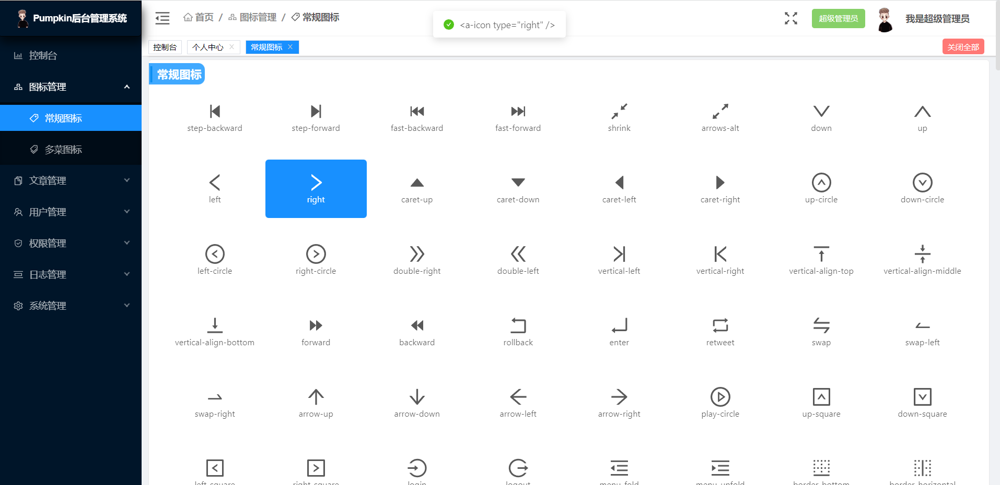
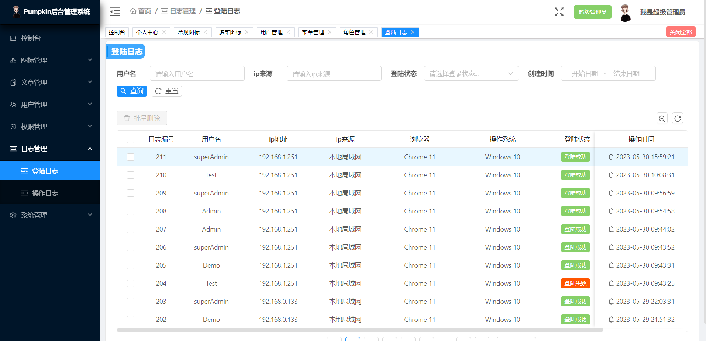
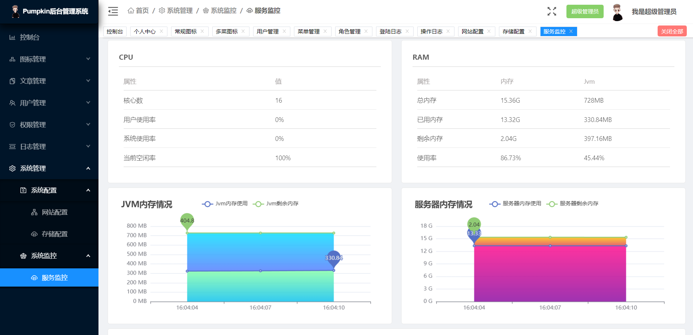

# Pumpkin模板后台管理系统

## 🎉 SpringBoot 2.* + Vue 2.* 的模板后台管理系统

## 🎊 前言

本项目是基于SpringBoot + Vue + Antd Vue组件库构建的模板后台管理系统，菜单页面控制、用户认证授权功能、系统控制等功能已经完成，
大家可以在本系统的基础上继续开发，做出更强的系统。所有前端后台代码封装过后十分精简易上手，出错概率低。

## 🎀 项目地址

> 在线体验地址：[http://www.pumpkin.nanjustar.top](http://www.pumpkin.nanjustar.top)

> GitHub地址：[https://github.com/duan-nan/Pumpkin-template](https://github.com/duan-nan/Pumpkin-template)
> 
> Gitee 地 址： [https://gitee.com/duan_nan/pumpkin-template](https://gitee.com/duan_nan/pumpkin-template)

## 🎏 说明

>  如果对您对此项目有兴趣，可以点 "Star" 支持一下 谢谢！ ^_^
> 
>  或者您可以 "follow" 一下，我会不断开源更多的有趣的项目
> 
>  如有问题请直接在 Issues 中提，或者您发现问题并有非常好的解决方案，欢迎 PR 👍
> 
>  传送门：[前端项目地址](https://gitee.com/duan_nan/pumpkin-template/tree/master/pumpkin-template-backstage)  、 [后台系统地址](https://gitee.com/duan_nan/pumpkin-template/tree/master/pumpkin-temaplte-server)

## 🎈 功能
### ✨ 技术栈
-   [x] SpringBoot
-   [x] SpringSecurity
-   [x] MySql
-   [x] MyBatisPlus
-   [x] Redis
-   [x] QQ邮箱
-   [x] 对象存储服务
-   [x] Vue
-   [x] axios
-   [x] Antd Vue

### 🎷 功能点

系统内现有功能点，后续根据需求会进行调整。

-   [x] 登录/注销
-   [x] 三级菜单栏
-   [x] 三级面包屑
-   [x] Tab 选项卡
-   [x] 个人中心
-   [x] 修改密码
-   [x] 图标管理
-   [x] 用户管理
-   [x] 菜单管理
-   [x] 角色管理
-   [x] 登陆日志
-   [x] 操作日志
-   [x] 网站配制
-   [x] 存储配制
-   [x] 服务监控

## 💎 项目截图

> 不同用户身份可以拥有不同的后台界面，其与用户的角色身份有关。而每个角色所拥有的的页面由超级管理员身份用户全权管理。

<table>
    <tr>
        <td></td>
        <td></td>
    </tr>
    <tr>
        <td></td>
        <td></td>
    </tr>
</table>

> 系统功能截图

<table>
    <tr>
        <td></td>
        <td></td>
    </tr>
    <tr>
        <td></td>
        <td></td>
    </tr>
    <tr>
        <td></td>
        <td></td>
    </tr>
    <tr>
        <td></td>
        <td></td>
    </tr>
    <tr>
        <td></td>
        <td></td>
    </tr>
    <tr>
        <td></td>
        <td></td>
    </tr>
    <tr>
        <td></td>
    </tr>
</table>

## 🔔 支持作者
请作者喝杯咖啡吧！

> 微信
> 

> 支付宝
> 

